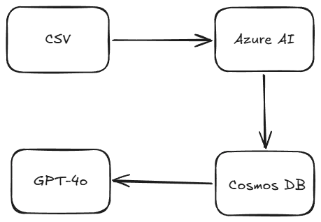

# 💎 Smart Support AI: Analytics Pro
### Enterprise Cloud Sentiment Analysis & GPT-4 Command Center

[](https://smart-support-v2.streamlit.app/)
[](https://azure.microsoft.com/)

[🔗 Connect on LinkedIn](https://www.linkedin.com/in/brendan-gobvu)

## Problem Statement
In modern e-commerce and SaaS, companies are flooded with thousands of customer reviews across multiple platforms. Manually categorizing these reviews is slow, prone to human bias, and makes it impossible to react to critical bugs in real-time.

**Smart Support AI** solves this by providing a high-speed, cloud-native pipeline that:
1.  **Automates Sentiment Analysis**: Instantly classifies feedback using Azure AI.
2.  **Centralizes Data**: Stores records in a globally scalable NoSQL database.
3.  **GPT-4 Insights**: Provides a natural language "Command Center" where managers can ask complex questions (e.g., "Summarize the technical issues from Android users in Poland") and get instant, data-driven answers.

---

## 🏗️ Architecture & Data Flow
The system follows a professional ETL (Extract, Transform, Load) and RAG (Retrieval-Augmented Generation) pattern:

**CSV Upload** → **Azure AI Language Service** (Sentiment Enrichment) → **Azure Cosmos DB** (NoSQL Storage) → **Azure OpenAI (GPT-4)** (Synthesis & Chat)



> **Pro Tip:** I used **Deterministic ID Logic** to ensure that re-uploading the same dataset updates existing records rather than creating duplicates—keeping the cloud database clean and cost-efficient.

---

## 🛠️ The "Enterprise" Stack
* **Frontend**: [Streamlit](https://streamlit.io/) (Premium Dashboard UI)
* **Language AI**: [Azure AI Language](https://azure.microsoft.com/en-us/products/ai-services/ai-language/) (Sentiment Analysis)
* **Brain**: [Azure OpenAI](https://azure.microsoft.com/en-us/products/ai-services/openai-service/) (GPT-4 Turbo)
* **Database**: [Azure Cosmos DB](https://azure.microsoft.com/en-us/products/cosmos-db/) (NoSQL / Partitioned by Company)
* **Language**: Python 3.9+

---

## 🚀 Key Features
* **Multi-Company Support**: Filter and analyze data for different services (Netflix, Allegro, etc.) within one interface.
* **Smart Search**: AI-powered querying that understands context, not just keywords.
* **Cloud-Sync**: Real-time upserting to Azure cloud infrastructure.
* **Premium UI**: A clean, three-column dashboard optimized for desktop analytics.

---

## ⚙️ Setup & Installation

1. **Clone the Repo:**
   ```bash
   git clone [https://github.com/YOUR_USERNAME/YOUR_REPO_NAME.git](https://github.com/YOUR_USERNAME/YOUR_REPO_NAME.git)
    cd YOUR_REPO_NAME

2. **Install Dependencies:**

   ```bash
   pip install -r requirements.txt
   
3. **Configure Environment:**
Create a .env file based on the .env.example provided and add your Azure credentials.

3. **Run the App:**

   ```bash
   streamlit run app.py

🛠 Local Setup Instructions
1. Database Configuration (PostgreSQL)
The app uses PostgreSQL to store user credentials and mirrored analytics data.

Create the Database: Ensure you have PostgreSQL installed and running. Create a new database named smart_support_db (or your preferred name).

Table Initialization: Run the following SQL commands to set up the necessary schema for user management:

SQL
-- Create Users table for login protection
CREATE TABLE users (
    id SERIAL PRIMARY KEY,
    username VARCHAR(50) UNIQUE NOT NULL,
    password_hash VARCHAR(255) NOT NULL,
    role VARCHAR(20) DEFAULT 'user'
);

-- (Optional) Create a table for mirrored analytics
CREATE TABLE support_analytics (
    row_id VARCHAR(100) PRIMARY KEY,
    company_name VARCHAR(100),
    sentiment VARCHAR(20),
    urgency_score INT,
    source_date DATE,
    original_text TEXT
);
2. Environment Variables (.env)
Create a file named .env in the root directory of the project. This file stores your secrets and configuration keys. Do not commit this file to GitHub.

Copy the template below and fill in your specific Azure and Database credentials:

   ```bash
   --- POSTGRESQL CONFIG ---
   DB_HOST=localhost
   DB_PORT=5432
   DB_NAME=smart_support_db
   DB_USER=postgres
   DB_PASSWORD=your_password_here
   
    --- AZURE AI LANGUAGE (Sentiment) ---
   AZURE_LANGUAGE_ENDPOINT=https://your-resource-name.cognitiveservices.azure.com/
   AZURE_LANGUAGE_KEY=your_language_subscription_key
   
    --- AZURE OPENAI (Command Center) ---
   AZURE_OPENAI_ENDPOINT=https://your-resource-name.openai.azure.com/
   AZURE_OPENAI_KEY=your_openai_api_key
   AZURE_OPENAI_DEPLOYMENT_NAME=gpt-4 # or your specific model deployment name
   
    --- AZURE COSMOS DB ---
   COSMOS_CONNECTION_STRING=your_cosmos_db_primary_connection_string
   COSMOS_DATABASE_ID=SupportAnalytics
   COSMOS_CONTAINER_ID=Reviews
   
   --- APP SECURITY ---
   SECRET_KEY=your_random_secret_key_for_session_management
   3. Installation & Launch
   Once your database is ready and .env is configured:

```
**Install dependencies:**

   ```bash
   pip install -r requirements.txt
```
**Run the app**
  ```bash
   pip install -r requirements.txt
```
Security Note: Always use synthetic data for testing. Ensure your .gitignore file includes .env to prevent leaking your Azure keys to the public repository.
